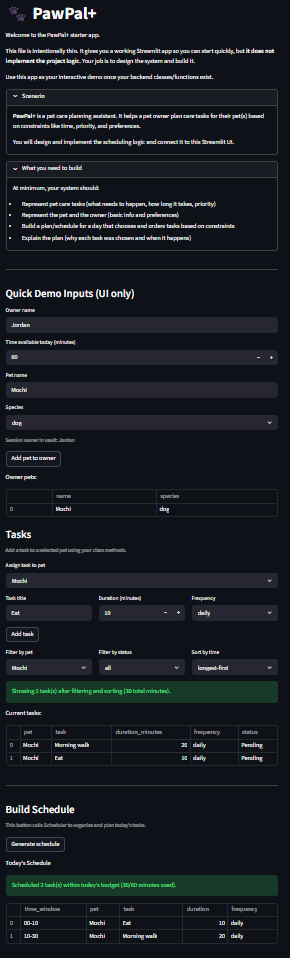

# PawPal+ (Module 2 Project)

You are building **PawPal+**, a Streamlit app that helps a pet owner plan care tasks for their pet.

## Scenario

A busy pet owner needs help staying consistent with pet care. They want an assistant that can:

- Track pet care tasks (walks, feeding, meds, enrichment, grooming, etc.)
- Consider constraints (time available, priority, owner preferences)
- Produce a daily plan and explain why it chose that plan

Your job is to design the system first (UML), then implement the logic in Python, then connect it to the Streamlit UI.

## What you will build

Your final app should:

- Let a user enter basic owner + pet info
- Let a user add/edit tasks (duration + priority at minimum)
- Generate a daily schedule/plan based on constraints and priorities
- Display the plan clearly (and ideally explain the reasoning)
- Include tests for the most important scheduling behaviors

## Features

Core algorithms currently implemented in PawPal+:

- Multi-key task ordering: tasks are sorted by completion state, recurrence frequency rank (`daily` -> `weekly` -> `monthly` -> `as-needed`), then duration.
- Sorting by time: standalone shortest-first or longest-first sorting by task duration.
- Recurrence-aware due logic: determines whether tasks are due based on frequency intervals (daily/weekly/monthly), completion history, and optional date-based due dates.
- Greedy daily scheduling: fills the available minute budget sequentially with ordered due tasks and defers any tasks that no longer fit.
- Time-budget conflict warnings: flags when total pending task minutes exceed the owner's available time.
- Preferred-time overlap detection: detects overlaps between preferred task windows for the same pet and across different pets.
- Scheduled-window conflict detection: pairwise overlap checks across concrete scheduled start/end windows.
- Daily/weekly recurrence spawning: when a recurring task is completed, the next occurrence is automatically created with the correct next due date.
- Duplicate recurring-task detection: identifies repeated task signatures (pet + normalized description + frequency).
- Lightweight safe conflict mode: returns structured warning objects and gracefully handles malformed/null values without crashing.

## 📸 Demo

Add your final Streamlit app screenshot to the repository as `image.png`, then it will render below:



## Getting started

### Setup

```bash
python -m venv .venv
source .venv/bin/activate  # Windows: .venv\Scripts\activate
pip install -r requirements.txt
```

### Suggested workflow

1. Read the scenario carefully and identify requirements and edge cases.
2. Draft a UML diagram (classes, attributes, methods, relationships).
3. Convert UML into Python class stubs (no logic yet).
4. Implement scheduling logic in small increments.
5. Add tests to verify key behaviors.
6. Connect your logic to the Streamlit UI in `app.py`.
7. Refine UML so it matches what you actually built.

## Testing PawPal+

Run the full test suite with:

```bash
python -m pytest
```

Current tests cover core scheduling reliability, including task sorting correctness, filtering by pet and completion state, recurring-task due logic, next-occurrence creation for daily/weekly tasks, preferred-time and scheduled-time conflict detection (including exact duplicate time windows), and lightweight conflict handling for malformed/edge-case data.

Confidence Level: ★★★★☆ (4/5)

Reasoning For Rating: The suite is consistently passing (33/33 tests) and exercises the most important happy paths plus critical edge cases. Confidence is not 5/5 because long-term runtime behavior and broader integration/UI scenarios are not fully stress-tested.